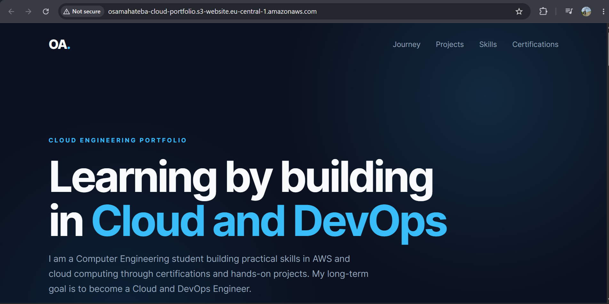
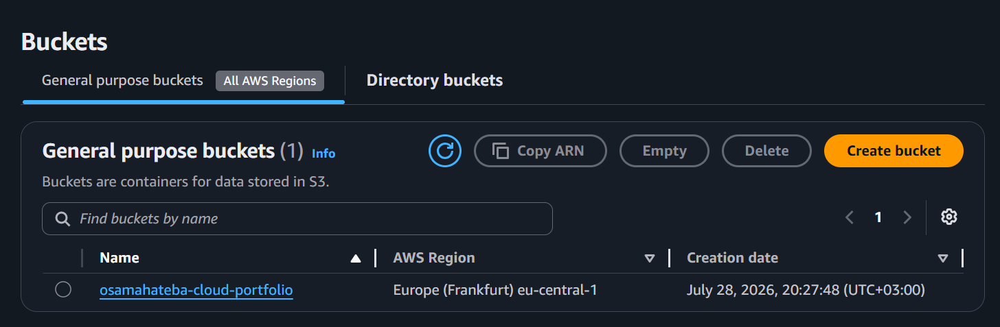
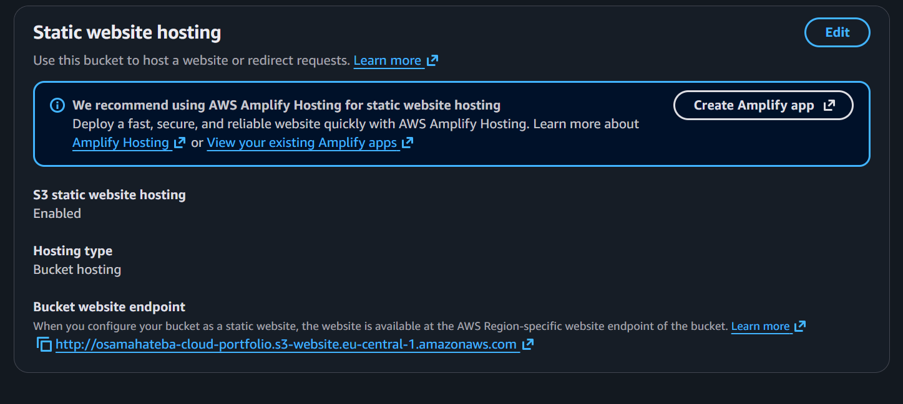

# Project 01 — Static Website Hosting on Amazon S3

## Overview

This project demonstrates how to deploy a static website using **Amazon S3**.

I created an S3 bucket, uploaded the website files, enabled Static Website Hosting, configured public access, and applied a bucket policy so the website could be accessed through the S3 website endpoint.

This was my first hands-on AWS portfolio project.

---

## Architecture

The project uses a simple static website architecture:

Browser → Amazon S3 Static Website Endpoint → HTML/CSS Files

Amazon S3 stores and serves the static website files without requiring a traditional web server.

---

## AWS Services and Features Used

- Amazon S3
- S3 Static Website Hosting
- S3 Bucket Policy
- S3 Public Access configuration

---

## Project Files

- `index.html` — Website structure and content
- `style.css` — Website styling
- `README.md` — Project documentation
- `screenshots/` — Evidence of deployment and AWS configuration

---

## Deployment Steps

1. Created an Amazon S3 bucket.
2. Uploaded `index.html` and `style.css`.
3. Enabled **Static Website Hosting**.
4. Configured the index document as `index.html`.
5. Configured the required public access settings.
6. Added an S3 bucket policy allowing public read access to the website objects.
7. Opened the S3 website endpoint and verified that the website was accessible.

---

## Security Note

The website is intentionally public because visitors need permission to retrieve its static files.

The bucket policy grants public read access to the website objects only. No AWS credentials, access keys, secret keys, or other sensitive information are stored in this repository.

For production architectures, additional services and security controls can be used instead of directly exposing an S3 website bucket.

---

## Screenshots

### Live Website

### S3 Bucket

### Static Website Hosting

---

## What I Learned

Through this project, I practiced:

- Creating and configuring an Amazon S3 bucket.
- Uploading and managing static website files.
- Enabling S3 Static Website Hosting.
- Understanding how bucket policies control access to S3 objects.
- Making website content publicly accessible.
- Testing an AWS-hosted static website.
- Documenting a cloud project using Git and GitHub.

---

## Future Improvements

Possible future improvements include:

- Using Amazon CloudFront for content delivery.
- Adding HTTPS.
- Using a custom domain with Amazon Route 53.
- Automating deployment through CI/CD.

These improvements are not implemented in the current version of the project.